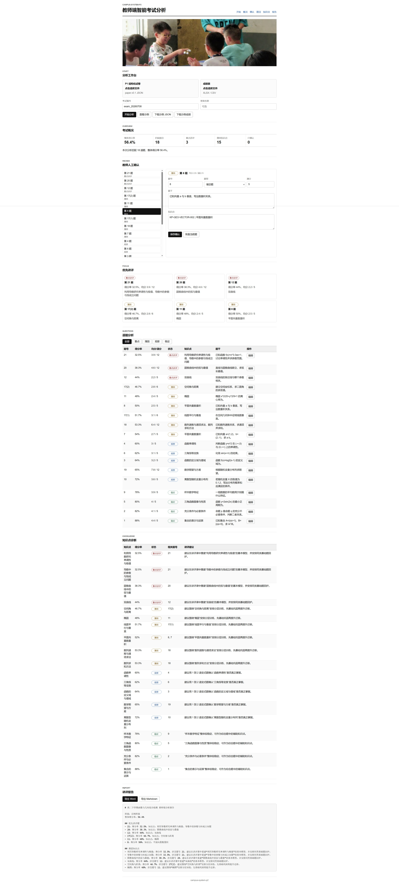

# campus-system-p2

`campus-system-p2` 是 Campus AI 教育系统的 P2 教师端子系统。它负责把考试文件、P1 结构化结果和 P3 题库能力组织成教师可用的智能考试分析系统：考试创建、文件上传、结构化结果查看、知识点诊断、讲评报告和 Word 教案导出。

## 目录

- [页面展示](#页面展示)
- [快速开始](#快速开始)
- [P2 完成情况表](#p2-完成情况表)
- [TODO List](#todo-list)
- [页面端使用教程](#页面端使用教程)
- [命令行使用教程](#命令行使用教程)
- [接口设计](#接口设计)
- [项目结构](#项目结构)
- [总结](#总结)

## 页面展示

页面端提供考试分析、教师人工确认、逐题诊断、知识点诊断和报告导出等主要操作入口。



## 快速开始

以下命令以 Windows PowerShell 环境为准。

### 1. 获取代码

```powershell
git clone xx
cd Campus-System-P2
```

### 2. 安装后端依赖

```powershell
python -m pip install -r backend\requirements.txt
```

### 3. 安装前端依赖

```powershell
cd frontend
pnpm install
cd ..
```

### 4. 启动后端

```powershell
cd backend
python -m uvicorn app.main:app --host 127.0.0.1 --port 8000
cd ..
```

### 5. 启动前端

另开一个终端：

```powershell
cd frontend
pnpm dev
```

默认打开：

```text
http://127.0.0.1:5173
```

如果后端端口不是 `8000`，启动前端前设置：

```powershell
$env:VITE_API_BASE_URL="http://127.0.0.1:<后端端口>"
pnpm dev
```

### 6. 一键验证

```powershell
python scripts\p2_smoke_test.py
```

期望输出包含：

```text
campus-system-p2 smoke test passed
questions=18
p3_requests=8
```

## P2 完成情况表

本表按 `systemdesign.docx` 中 P2 职责和第一阶段交付要求核验。

| 文档要求 | 当前状态 | 完成度 | 说明 |
|---|---|---|---|
| 管理考试、班级、试卷、阅卷数据和教师上传文件 | 部分完成 | 60% | 标准接口支持创建考试和上传文件；暂未做登录、考试列表和持久化 |
| 调用 P1 完成 Excel 与试卷结构化解析 | 部分完成 | 45% | 当前用 XLSX/CSV 与 `paper.v0.1 JSON` mock 跑通；真实 P1 HTTP 调用待接入 |
| 提供教师校正界面，修正题号、题干、题型和知识点 | 已完成 | 100% | 页面已支持题号、题干、题型、满分、知识点确认 |
| 保存教师确认后的考试题目、分数统计和知识点映射 | 部分完成 | 65% | 前端状态和标准接口均可保存；数据库持久化待做 |
| 调用 P3 检索薄弱知识点对应题目，生成讲评练习建议 | 部分完成 | 35% | 已生成 P3 检索请求；真实 P3 `/questions/search`、`/practice-packs` 待接入 |
| 按学校模板生成 Word 讲评教案 | 部分完成 | 70% | 已支持 Word 报告导出；学校模板、页眉页脚、推荐题排版待增强 |

## TODO List

- 对接真实 P1：让 `/exams/{exam_id}/parse` 调用 P1 的 `/parse/score-excel` 和 `/parse/paper`。
- 对接真实 P3：把诊断后的薄弱知识点传给 `/questions/search` 和 `/practice-packs`。
- 增加图片校正能力：接入 P1 返回的图片引用，支持题目图片查看、替换和标注。
- 增加真实考试列表和本地持久化：当前标准接口使用内存态，适合 Demo。
- 完善 Word 教案模板：接入学校模板、Logo、页眉页脚和练习题推荐。
- 增加个人学生报告：需要成绩表从班级均分扩展到学生逐题矩阵。
- 打包桌面版：保持 GUI 与算法逻辑分离，后续可用 PyInstaller 或桌面壳封装。

## 页面端使用教程

### 查看 Demo

1. 启动后端和前端。
2. 打开前端页面。
3. 页面会自动载入 Demo 分析结果。
4. 在“教师人工确认”区域逐题修正题号、题干、题型、满分和知识点。
5. 点击“重点 / 薄弱 / 观察 / 稳定”筛选题目。
6. 点击“导出 Word”或“导出 Markdown”下载讲评报告。

### 使用自己的数据

1. 点击“下载示例 JSON”和“下载示例成绩”查看输入格式。
2. 上传 P1 输出的 `paper.v0.1 JSON`。
3. 上传阅卷成绩表。
4. 可填写考试编号和班级名称。
5. 点击“开始分析”。
6. 页面会展示考试概况、教师人工确认、优先讲评题、逐题分析、知识点诊断和报告导出入口。

注意：如果手上只有 Word/PDF/图片试卷，需要先经过 P1 解析；P2 独立包不直接做 OCR、切题或版面解析。

## 命令行使用教程

校验 P1 结构化试卷：

```powershell
python scripts\validate_normalized_paper.py examples\normalized_paper_demo.json
```

运行一次 P2 分析：

```powershell
python scripts\p2_analyze_exam.py `
  --paper examples\normalized_paper_demo.json `
  --scores examples\sample_exam_scores.xlsx `
  --exam-id exam_demo_001 `
  --class-name 示例班级 `
  --out data\exams\exam_demo_001_analysis.json
```

输出文件：

```text
data/exams/exam_demo_001_analysis.json
data/exams/exam_demo_001_report.md
data/exams/exam_demo_001_report.docx
```

运行完整smoke test：

```powershell
python scripts\p2_smoke_test.py
```

smoke test覆盖：

- P1 JSON 结构校验。
- P2 service 直接分析。
- JSON / Markdown / DOCX 导出。
- 页面便捷 API。
- `systemdesign.docx` 第 7 节对应的 P2 标准接口主流程。

## 接口设计

### 接口核验结论

已核验 `systemdesign.docx`，当前项目包含两组接口：

1. 标准 P2 接口：对齐文档第 7 节，面向最终系统集成。
2. Demo 便捷接口：`/api/p2/*`，面向当前前端和独立演示。

标准接口已与 Word 文档中的核心 P2 流程保持一致；便捷接口是为了在 P1/P3 未完全接入前简化本地演示。

### 标准 P2 接口

| 方法 | 路径 | 文档对应 | 当前状态 |
|---|---|---|---|
| `POST` | `/exams` | 7.1 创建考试 | 已实现 |
| `POST` | `/exams/{exam_id}/files` | 7.2 上传考试文件 | 已实现 |
| `POST` | `/exams/{exam_id}/parse` | 7.3 启动考试解析 | 已实现；JSON mock 可直接跑通，Word/PDF 需 P1 |
| `GET` | `/exams/{exam_id}/structure` | 7.4 获取考试结构化结果 | 已实现 |
| `PUT` | `/exams/{exam_id}/questions/{exam_question_id}` | 7.5 教师修正题目结构 | 已实现基础更新 |
| `PUT` | `/exams/{exam_id}/questions/{exam_question_id}/knowledge-tags` | 7.6 教师确认知识点 | 已实现基础更新 |
| `POST` | `/exams/{exam_id}/diagnostics/run` | 7.7 运行考试诊断 | 已实现 |
| `GET` | `/exams/{exam_id}/diagnostics/{diagnostic_id}` | 7.8 获取诊断报告 | 已实现 |
| `POST` | `/exams/{exam_id}/lesson-plans` | 7.9 生成 Word 教案 | 已实现元数据返回；真实模板增强待做 |

### Demo 便捷接口

| 方法 | 路径 | 用途 |
|---|---|---|
| `GET` | `/api/health` | 服务健康检查 |
| `GET` | `/api/model/status` | 模型状态说明 |
| `GET` | `/api/p2/demo` | 获取内置 Demo 分析 |
| `GET` | `/api/p2/examples/paper` | 下载示例 `paper.v0.1 JSON` |
| `GET` | `/api/p2/examples/scores` | 下载示例成绩表 |
| `POST` | `/api/p2/analyze` | 上传 JSON 和成绩表，直接运行 P2 分析 |
| `POST` | `/api/p2/reports/docx` | 导出 Word 报告 |
| `POST` | `/api/p2/reports/markdown` | 导出 Markdown 报告 |

## 项目结构

```text
campus-system-p2/
  backend/                  # FastAPI 后端
  campus_p2_core/           # P2 核心算法与契约
  docs/                     # README 图片等文档资源
  examples/                 # Demo 输入数据
  frontend/                 # React/Vite 前端
  scripts/                  # 校验和烟测脚本
```

## 总结

当前 P2 已满足第一阶段 Demo 要求：

- 独立页面可操作。
- 核心逻辑可跑通。
- 标准接口主流程已按文档补齐。
- 便捷接口支持快速演示。
- 对 P1/P3 的真实依赖已明确留口。
