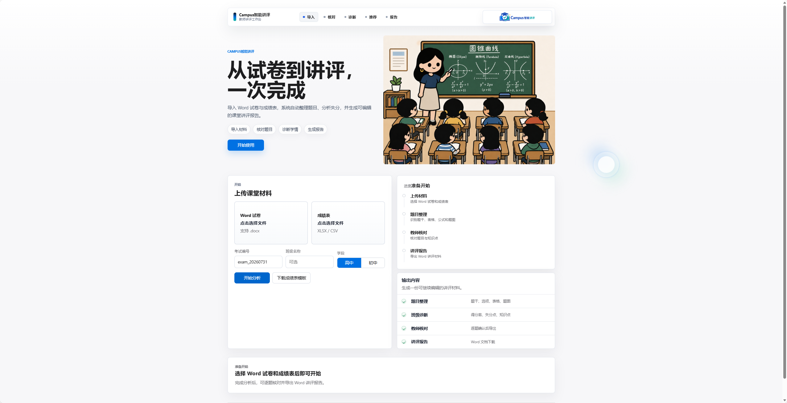
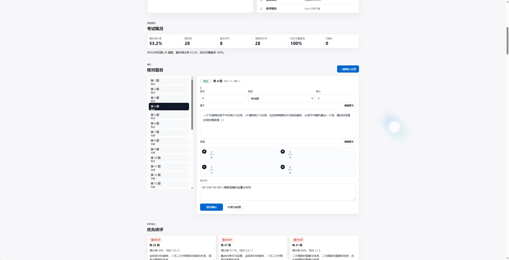
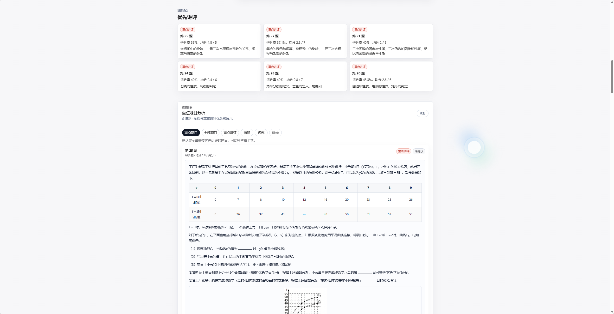
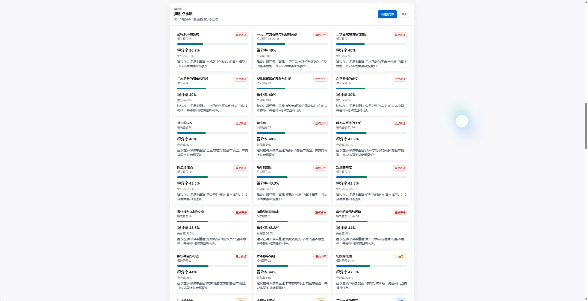
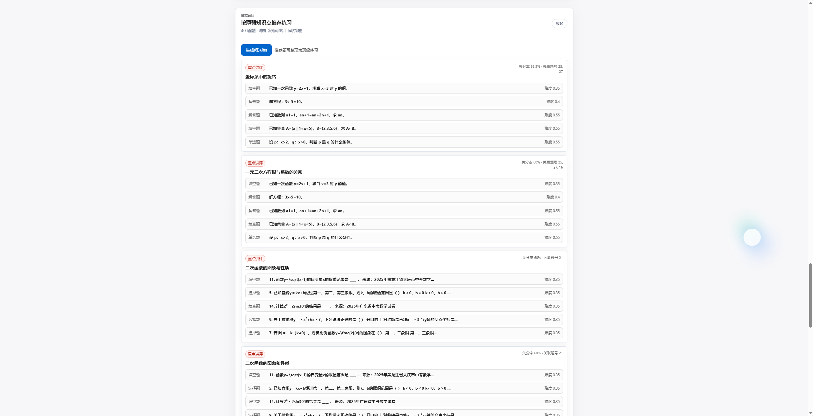
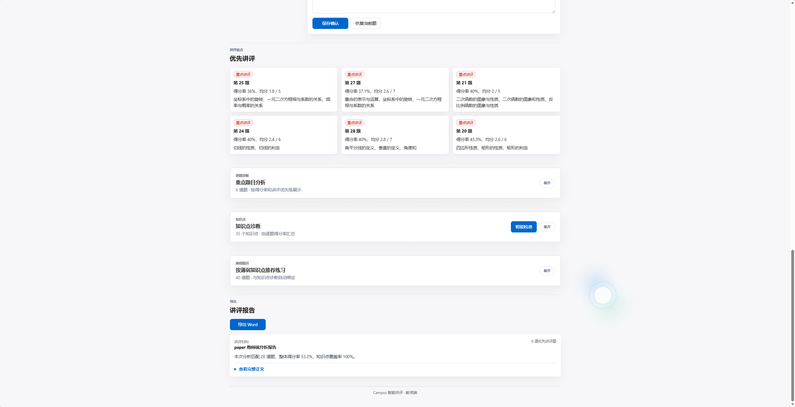

# Campus-System

Campus-System 是面向学校教师的智能讲评系统原型。当前主流程聚焦“Word 试卷 + 成绩表 -> 题目核对 -> 学情诊断 -> 推荐练习 -> Word 讲评报告”，适合用于第一版产品演示和后续模块联调。

## 目录

- [页面展示](#页面展示)
- [快速开始](#快速开始)
- [演示素材](#演示素材)
- [页面使用](#页面使用)
- [部署说明](#部署说明)
- [主要特征](#主要特征)
- [技术点](#技术点)
- [完成情况](#完成情况)
- [项目结构](#项目结构)

## 页面展示

| 首页与上传 | 题目核对 |
|---|---|
|  |  |

| 优先讲评 | 知识点诊断 |
|---|---|
|  |  |

| 推荐题目 | 报告导出 |
|---|---|
|  |  |

## 快速开始

以下命令以 Windows PowerShell 为准。

```powershell
git clone git@github.com:Jokerealm/Campus-System.git
cd Campus-System
powershell -NoProfile -ExecutionPolicy Bypass -File .\scripts\start_local_demo.ps1
```

启动后打开：

```text
教师端: http://127.0.0.1:5176/?apiBase=http%3A%2F%2F127.0.0.1%3A8000
P2 API: http://127.0.0.1:8000
P3 API: http://127.0.0.1:8103
```

停止本地服务：

```powershell
powershell -NoProfile -ExecutionPolicy Bypass -File .\scripts\stop_local_demo.ps1
```

## 演示素材

- Word 试卷样例：`examples/demo_inputs/2025年上海市中考数学试卷.docx`
- 成绩表样例：`examples/demo_inputs/sample_exam_scores.xlsx`
- 50 套示范成绩表：`examples/demo_score_sheets_50/`
- 50 套示范成绩表压缩包：`examples/demo_score_sheets_50.zip`

演示时在首页上传 Word 试卷和成绩表，然后点击“开始分析”即可跑通主流程。

## 页面使用

1. 上传 Word 试卷和成绩表。
2. 系统解析题目、题型、选项、表格、题图和成绩统计。
3. 在“核对题目”中逐题确认题干、题型、满分和知识点，也可以一键确认全部。
4. 查看“优先讲评”和“知识点诊断”，定位班级薄弱点。
5. 查看并编辑“推荐题目”，推荐会随知识点和失分率刷新。
6. 点击“导出 Word”，生成可继续修改的讲评报告。

## 部署说明

本地演示部署由 `scripts/start_local_demo.ps1` 托管，会自动准备 Python 虚拟环境、前端依赖、SQLite 数据库、P2 服务、P3 服务和 Vite 前端。

如需手动启动：

```powershell
cd backend
python -m uvicorn app.main:app --host 127.0.0.1 --port 8000
```

另开终端：

```powershell
cd frontend
pnpm install
pnpm dev --host 127.0.0.1 --port 5176
```

如需启用大模型能力，请在本地 `.env` 中配置 `CAMPUS_LLM_BASE_URL`、`CAMPUS_LLM_API_KEY` 和 `CAMPUS_LLM_MODEL`。仓库只提交 `.env.example`，不要提交真实密钥。

## 主要特征

- 正式教师端界面：默认页面只保留客户可见的上传、核对、诊断、推荐和导出流程。
- Word 切题：支持从 `.docx` 中提取题干、选项、表格、图片和基础数学排版。
- 教师确认：支持逐题编辑题干、题型、满分、题图和知识点。
- 学情诊断：按得分率、失分率和知识点聚合班级薄弱项。
- 推荐练习：按薄弱知识点检索题库，推荐题随知识点和错误率更新。
- 讲评报告：生成 Word 讲评材料，包含考试概况、优先讲评题、知识点诊断和推荐练习。
- 管理能力：保留服务状态、审计日志、AI 生成题审核等管理员入口，但默认不暴露给教师演示首页。

## 技术点

- 后端：FastAPI + Pydantic 契约 + SQLite 本地持久化。
- 前端：React + Vite，教师端工作台式布局。
- P1：Word 试卷结构化解析，输出标准化题目结构。
- P2：考试管理、成绩分析、教师确认、知识点诊断、报告导出。
- P3：题库、知识点、推荐题和训练包接口。
- 大模型：可选 OpenAI-compatible API，用于知识点智能校准和题目生成；未配置时使用规则兜底。
- 交付脚本：PowerShell 一键启动/停止，本地 smoke 与 preflight 脚本用于演示前自检。

## 完成情况

| 模块 | 状态 | 说明 |
|---|---|---|
| 教师端主流程 | 已实现 | Word + 成绩表上传、题目核对、诊断、推荐、导出可跑通 |
| Word 切题 | 已实现第一版 | 适合格式较规范的 Word 试卷，公式/表格/图片已做基础保真 |
| 成绩表解析 | 已实现 | 支持示范 Excel/CSV 格式 |
| 知识点诊断 | 已实现 | 规则标注 + 可选大模型校准 |
| 推荐题目 | 已实现 | 与知识点和失分率绑定，可编辑 |
| Word 讲评报告 | 已实现第一版 | 可下载并继续人工修改 |
| 题库服务 | 已实现第一版 | 50 套示范成绩表和题库 fixture 可用于演示 |
| PDF/图片切题 | 未作为默认流程 | 仍需 OCR/VLM 工程化优化，当前演示默认使用 Word 切题 |
| 正式账号/RBAC | 未实现生产版 | 当前为本地演示身份和基础权限边界 |
| 生产部署 | 未完成 | 当前以 Windows 本地演示和内网试运行为主 |

## 项目结构

```text
backend/                 P2 FastAPI 服务
frontend/                教师端/学生端/管理端前端
campus_p1/               P1 输入处理与 Word 切题相关代码
campus_p2_core/          P2 契约、分析、报告导出、P3 适配
campus_p3/               题库、知识点和学生练习服务
examples/                演示输入、成绩表和账号目录样例
docs/screenshots/        README 页面截图
scripts/                 启停、smoke、preflight 和导入脚本
```

